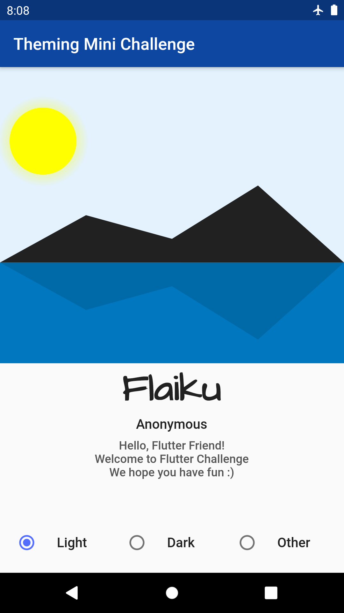
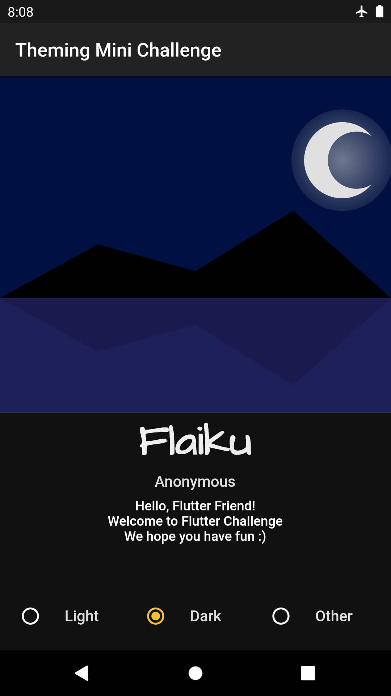
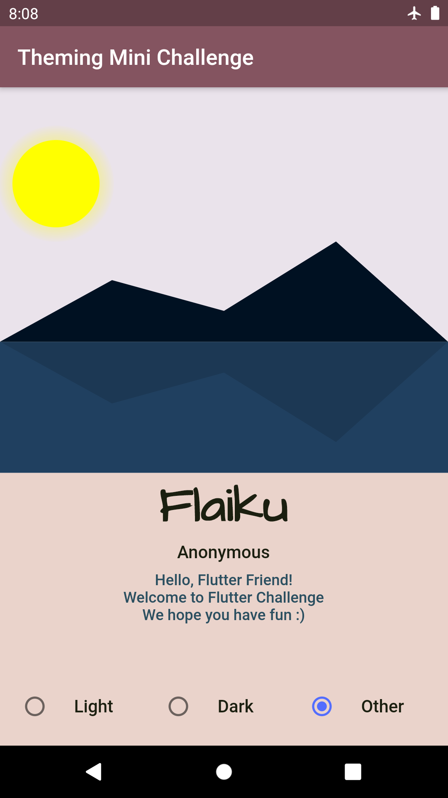

## Flutter Challenge #1!

This Mini Challenge is about taking the sample [starter app](https://github.com/Flutter-Challenge/mini_challenge_1_starter_app/) and making it shine with a custom theme.

Partnering with the [Flutteristas](https://flutteristas.org/) for this launch. The winners will be declared at the first-ever [Flutteristas Conference](https://ti.to/flutteristas/flutteristas-2021) on April 17th!

&nbsp;&nbsp;

For my own education I added a Google Font using the [google_fonts](https://pub.dev/packages/google_fonts) package.
